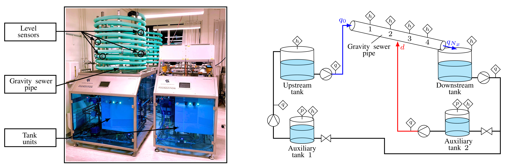

# A Learning-based Approach Towards the Data-driven Predictive Control of Wastewater Networks – An Experimental Study

This repository is a how-to documentation for the control toolchain designed in the work: "A Learning-based Approach Towards the Data-driven Predictive Control of Wastewater Networks – An Experimental Study".  

>The abstract goes here. The abstract goes here. The abstract goes here. The abstract goes here. The abstract goes here. The abstract goes here. The abstract goes here. The abstract goes here. The abstract goes here. The abstract goes here. The abstract goes here. The abstract goes here. The abstract goes here. The abstract goes here. The abstract goes here. The abstract goes here. The abstract goes here. The abstract goes here. The abstract goes here. The abstract goes here. The abstract goes here.



## Table of contents
* [How to cite](#how-to-cite)
* [Requirements](#requirements)
* [Data collection](#data-collection)
* [Data loader](#data-loader)
* [Dependencies](#dependencies)
* [Tools](#tools)
* [Documentation](#documentation)
* [Simulator](#simulator)
* [GP-MPC controller](#GP-MPC-controller)

## How to cite

>Paper harvard style

```
@article{name_article,
title = "A Learning-based Approach Towards the Data-driven Predictive Control of Wastewater Networks – An Experimental Study",
author = "Balla, {Krisztian Mark} and Bendtsen, {Jan Dimon} and Kalles{\o}e, {Carsten Skovmose} and Carlos Ocampo-Martinez",
year = "unspecified",
language = "English",
journal = "unspecified",
issn = "unspecified",
publisher = "unspecified",
}
```

## Requirements

* [Casadi](https://web.casadi.org/docs/) : To solve and simulate all dynamic optimization included in this project.
* [fitrgp()](https://se.mathworks.com/help/stats/fitrgp.html) : To obtain the hyperparameters through Bayesian optimization with Gaussian Process regression.
* [Simulink](https://www.mathworks.com/products/simulink.html) : To deploy the real-time controller to the experimental setup with ModBus.
* [CodeSys](https://www.codesys.com/) : To control valves, pumps and tank units on the setup through virtual PLCs.

## Data collection
Randomized Onoff, rule-based Onoff and closed loop deterministic MPC data collection scripts for the experimental setup. 
* Onoff randomized data collection
* Rule-based Onoff data collection

## Data loader
Workspace is saved in the `data` folder. Run `dataLoad.m` to plot the results of the experiment. 

## Dependencies
Add this folder to the path when running experiments on the AAU Smart Water Lab. 
* Matlab Modbus
* Real-time pacer
	
## Tools
Tools designed specifically for the Smart Water Laboratory experiments. 
* Manual control : Run the Simulink file `Manual_Pump_Control.slx` to manually control the pumps on the experimental setup with the use of sliding bars. 
* Lab setup initialization: Run the Simulink file `outter_tanks_init.slx` to bring the inner and outer tanks to a pre-defined initial state before starting the experiments.

## Documentation
Detailed documentation (`WW Lab setup doc.pdf`) with illustrations for the topological layout and the physical description of the expereimental setup. 

## Simulator
An exact simulator designed specifically for the experimental setup. The simulator represents the equivalent of the Smart Water Lab. The purpose of this simulator is the reproducability of the tests in simulation in case the laboratory access is out of scope. The modelling used in the simulator setup is based on the article: 

>Balla, KM, Schou, C, Bendtsen, JD, Ocampo-Martinez, C & Kallesøe, C 2021, 'A Nonlinear Predictive Control Approach for Urban Drainage Networks Using Data-Driven Models and Moving Horizon Estimation', IEEE Transactions on Control Systems Technology.

* simulator PDE based: Run the `main_simulator.m` file to start the simulation. There are two types of controllers implemented in this simulator. In the simulation loop select number 1 to execute `onoff_control.m` for rule-based on/off control or number 2 to build `MPC_builder.m` to execute the PDE-based MPC.
* simulator GP : (description in progress)

## GP-MPC controller
The closed-loop controller deployed to the Smart Water Laboratory.  

